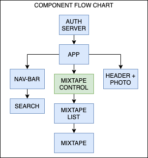

# 90 POINT NEVER 
## A WEB APPLICATION FOR SPOTIFY PLAYLIST DISCOVERY 

#### By Drake Wilcox

## Component Flow Chart

## User Stories
* A User should be able to sign into the page via Spotify Authorization. 
* A User should be able to view a grid of playlists with Name, description and playlist photo on the home page. 
* A User should be able to navigate to a playlist details with a play button when clicking on a playlist on the home page. 
* A User should be able to search a playlist by name or tags in a search bar. 

## Installation/Setup

## Support and Contact Details
_Have a bug or an issue with this application? [Open a new issue](https://github.com/drakewilcox/point-never/issues) here on GitHub._

## Technologies Used
* This project was bootstrapped with [Create React App](https://github.com/facebook/create-react-app).
* Components Diagram made with [Draw IO](https://draw.io/).

## License
[MIT](https://choosealicense.com/licenses/mit/)

Copyright (c) 2020 **_Drake Wilcox_**
